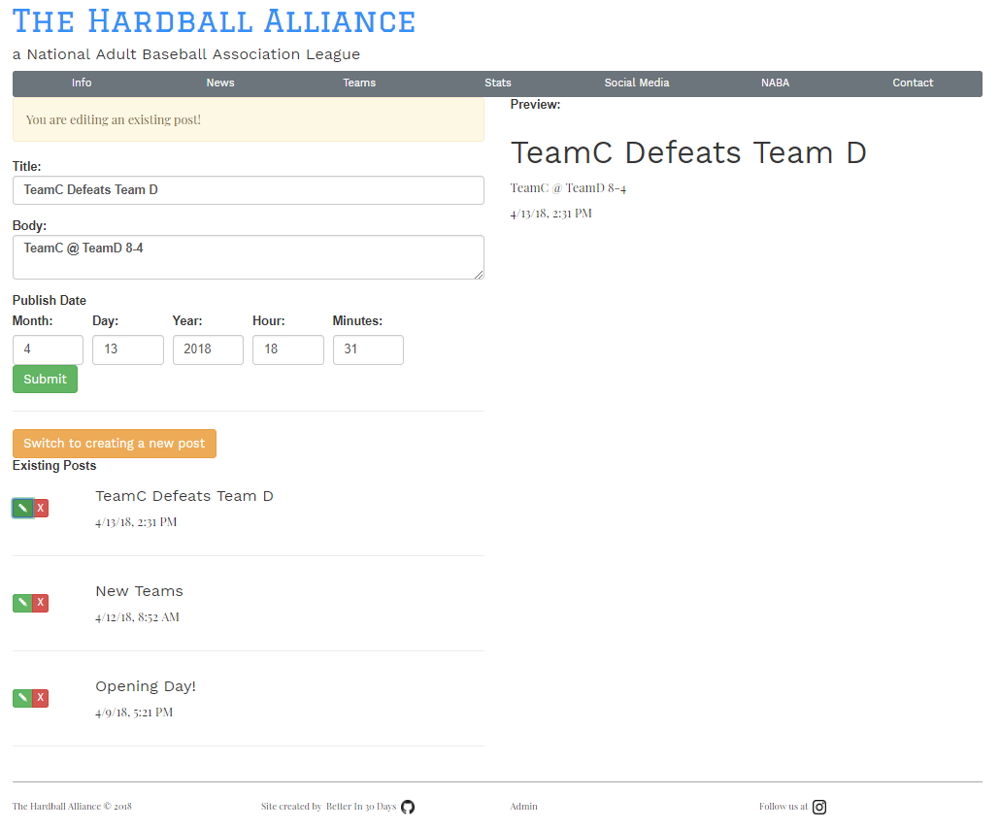
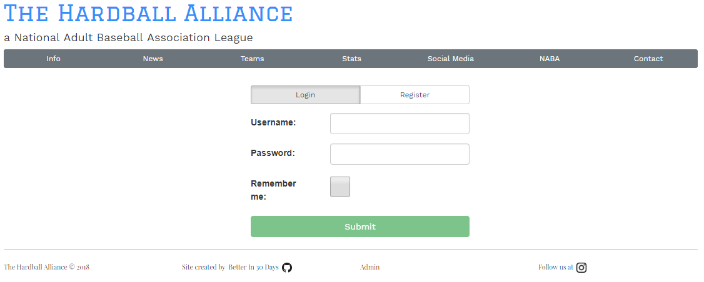

# Thehardballalliance.com

This is a SPA website for a local baseball league, The Hardball Alliance, made to allow the users to dynamically update content on their own.

## News Feed
There is a news feed displayed in the main section of the page, with an admin page to manage the posts. Users can create, delete, and update all posts.  
  

## Login/Registration
Registration is allowed for users that are on a whitelist (a row with just that username exists in the db). Passwords are hashed with a unique salt using pbkdf2. The username, salt, and passhash are stored in a database. The password is never retained.

## Stack
Serverside consists of nodejs running an express server with connections to a postgreSQL database. Client side is generated using Angular 5.

## Development server

Run `ng build` to generate bundles  
Run `npm run start` to start an express server  
Navigate to `http://localhost:8080/`

## Production build

Run `npm run build` to build the project. The build artifacts will be stored in the `dist/` directory.

## Running unit tests

Run `ng test` to execute the unit tests via [Karma](https://karma-runner.github.io).

## Running end-to-end tests

Run `ng e2e` to execute the end-to-end tests via [Protractor](http://www.protractortest.org/).

